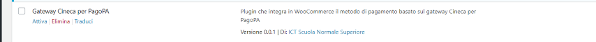
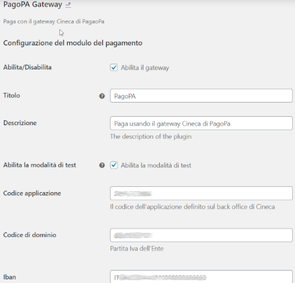
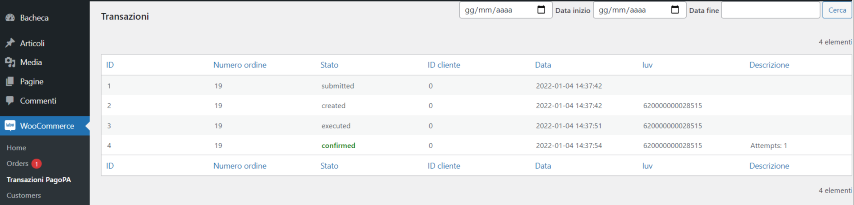

#  PagoPA Gateway 
**PagoPa Gateway** is a **WooCommerce plugin** for integration with **PagoPA Cineca payment portal**.

It is a payment gateway than can be used on a site implemented with *WordPress* and *WooCommerce*.

**PagoPa Gateway** allows the customers of your e-commerce to pay with **PagoPA** using a **credit card** or printing the payment notice and paying it **offline**.

The project was born from the need to integrate the payment method PagoPA into the site "Edizioni" ([edizioni.sns.it](https://edizioni.sns.it)) using the [portale dei pagamenti PagoPA Cineca](https://sns.pagoatenei.cineca.it/).

## Project status
Beta testing

## Features
- Pay order using PagoPA.
- Form to configure the connection to the Cineca gateway.
- Test and production distinct configurations.
- Management of payment worflow.
- A schedulable action to manage and update the orders paid offline.
- Internationalization of messages and labels.
- Check all the transactions from the backoffice.

## Getting started
1. First ask Cineca to activate the service and to activate the test and the production enviroment. They will give you the following data for both the test and the production enviroment:
   - The Api username.
   - The Api password.
   - The WSDL of the service.
   - An SSL certificate with the related passphrase.
2. Check if the software requirements are satisfied (see the "*Software requirements*" paragraph of this file).
3. Download, install and configure the plugin as described in the "*Installation and configuration*" paragraph of this document.

## Software requirements
1. The Wordpress CMS (version >= 5.6.6).
2. The WooCommerce plugin (version >= 5.0.0) for WordPress.
3. The web server Apache with *mod_ssl* and *soap* extension installed and enabled.
4. See section "Custom fields".

## Custom fields
At the moment the uses the following fields to fill the request that creates a payment on the gateway: **_billing_ita_cf** (fiscal code for persons) and **_billing_vat** (vat for companies).
We have another plugin that adds these meta tags to the order, but unfortunately we have not yet publicly released it.
If these fields are not specified, the plugin works the same but the user will be considered a person with **Fiscal Code = First Name + Last Name**.

## Installation and configuration
1. [Download](https://github.com/ScuolaNormaleSuperiore/wp-pagopa-gateway-cineca/archive/refs/heads/main.zip) the last stable version of the plugin.
2. Unzip the content into the wp-content/plugins folder.
3. Activate the plugin from the administration interface of Wordpress. 
4. Configure the plugin from the administration interface of Worpdress. The following fields must be specified:
   - **Enable/disable**: the flag to enable the payment gateway.
   - **Title**: the name of the gateway, will be shown in the checkout page.
   - **Description en**: a description for the payment method, will be shown in the english version of the checkout page.
   - **Description it**: a description for the payment method, will be shown in the italian version of the checkout page.
   - **Enable/Disable test mode**: the flag to enable the test mode.
   - **Payment confirmation method**: 
   - - **Polling on PagoAtenei**: The order is considered paid if the payment callback is called with a valid token and exists a pendig order with that order_id and iuv. A further control on the state can be activated enabling the option "Payment confirmation".
   - - **Asycnhronous notification by PagoAtenei**: The order is considered paid only if PagoAtenei sends a paNotificaTransazione message with esito=PAGAMENTO_ESEGUITO.
   - **Payment confirmation**: If set, the callback invoked after payment waits for the payment to be propagated from the PSP to PagoAtenei. This verification is done with a polling on Pagoatenei. If not set, the plugin considers the order paid without further checks.
   - **Aplication code**: the application code assigned by Cineca.
   - **Domain code**: the Vat code of the institution.
   - **Iban**: the Iban of the institution.
   - **Accounting type**: accounting code as defined in the PagoPA taxonomy (https://github.com/pagopa/pagopa-api/blob/develop/taxonomy/tassonomia.json).
   - **Payment model ID**: the ID of the payment model defined in the Cineca backoffice related to the payments coming from the e-commerce. This model will be accessible also from the Cineca frontoffice.
   - **Validity of the payment**: Number of hours the payment is valid. you can pay also offline using the Iuv code.
   - **Certificate name**: the name of the *pem* certificate provided by Cineca. If the certificate has a *pk12* format it must be converted to the *pem* format.
   - **Certificate password**: the password of the certificate provided by Cineca.
   - **Order prefix**: a prefix that is added to the WP order number before being sent to the gateway. You can leave it empty. It is useful if you use multiple instances of the site in test or dev enviroments to keep separate the orders of the various instances.
   - **Encryption key**: the key used to encrypt the token passed to the gateway.
   - **API token**: the token used to start the scheduled actions and the REST API. If empty these features are disabled.
   - 
  
  **Production credentials**
   - **Cineca front end url**: the url of the front end of PagoAtenei. It is provided by Cineca.
   - **PagoAtenei API base url**: the base url of the PagoAtenei Soap web services. It is provided by Cineca.
   - **PagoAtenei API username**: the username to use the Soap web services of PagoAtenei. It is provided by Cineca.
   - **PagoAtenei API password**: the password to use the Soap web services of PagoAtenei. It is provided by Cineca.
   - **Local API username**: the username of the account used to protect the paNotificaTransazione entry-point. It must be communicated to Cineca.
   - **Local API password**:the password of the account used to protect the paNotificaTransazione entry-point. It must be communicated to Cineca.
 
  **Test credentials**
   - **Cineca front end url**: the url of the front end of PagoAtenei. It is provided by Cineca.
   - **PagoAtenei API base url**: the base url of the PagoAtenei Soap web services. It is provided by Cineca.
   - **PagoAtenei API username**: the username to use the Soap web services of PagoAtenei. It is provided by Cineca.
   - **PagoAtenei API password**: the password to use the Soap web services of PagoAtenei. It is provided by Cineca.
   - **Local API username**: the username of the account used to protect the paNotificaTransazione entry-point. It must be communicated to Cineca.
   - **Local API password**:the password of the account used to protect the paNotificaTransazione entry-point. It must be communicated to Cineca.

## Payment confimation: possible configurations
- **Payment confirmation method** = ***Asycnhronous notification by PagoAtenei*** and **Payment confirmation** = ***false***: The order is considered paid only if a paNotificaTransazione is invoked by PagoAtenei. The site must be hosted on a public server and Cineca must be asked to activate and configure the message paNotificaTransazione. You can't try this configuration on a local development enviroment.
- **Payment confirmation method** = ***Polling on PagoAtenei*** and **Payment confirmation** = ***false***: The order is considered paid when the callback is correctly invoked and the order is in the right state. No further checks are carried out.
- **Payment confirmation method** = ***Polling on PagoAtenei*** and **Payment confirmation** = ***true***: The callback, after checking the token and the order state, starts a polling on PagoAtenei until PagoAtenei receives the payment confirmation from the PSP.

The first is the suggested and most secure configuration.
## Schemas of the flow
The following two pictures explain how the system works:
- [States schema](https://github.com/ScuolaNormaleSuperiore/wp-pagopa-gateway-cineca/blob/main/docs/schema/SchemaDegliStati.png)
- [Payment schema](https://github.com/ScuolaNormaleSuperiore/wp-pagopa-gateway-cineca/blob/main/docs/schema/SchemaDeiPagamenti.png)

## How to test the PagoAtenei's SOAP Api
After having requested and obtained the connection parameters from Cineca, you can use SoapUI to test the SOAP web services. In the setup\TestSoap directory you can find a SOAP project or you can create a new project using this [WSDL](https://gateway.pp.pagoatenei.cineca.it/portalepagamenti.server.gateway/api/private/soap/GPAppPort?wsdl).

## Entry points and callback
The plugin exposes these three entry-points:

1. HOOK_PAYMENT_COMPLETE --> pagopa_payment_complete: is the callback called by PagoAtenei when an order is paid or cancelled.

2. HOOK_SCHEDULED_ACTIONS --> pagopa_execute_actions: is am entry-point that a cronjob can call to manage the orders payd offline.

3. HOOK_TRANSACTION_NOTIFICATION --> pagopa_notifica_transazione: is an entry point called by PagoAtenei to notify a payment.

## Gallery

**Image 1:** Backoffice: enable the plugin.

 

**Image 2:** Backoffice: configure the plugin.

**Image 3:** Backoffice: check transactions.

## Documentation
- Check the docs folder of the plugin.
- Check the setup/TestSoap for the SoapUI project to test the Soap api.
- Check the Cineca site for further Api documents:
	- [Modalità di Integrazione](https://wiki.u-gov.it/confluence/pages/releaseview.action?pageId=329846832)
	- [WS pago-ATENEI Applicazioni](https://wiki.u-gov.it/confluence/display/public/UGOVINT/WS+pago-ATENEI+Applicazioni)

## Demo
### Docker
You can test the plugin using a *Docker* container that runs all the software components needed (Wordpress + WooCommerce + wp-pagopa-gateway-cineca). See this Docker file: [Dockerfile](https://github.com/ScuolaNormaleSuperiore/wp-pagopa-gateway-cineca/blob/main/setup/Docker/Dockerfile).

The commands to build and run the container are:
- docker build -t myshop-img -f Dockerfile .
- docker run -p 80:80 -p 3306:3306 --name=myshop -d myshop-img
 
To get the container shell run:
- docker exec -it myshop /bin/bash
  
To url of the e-commerce is: http://localhost/myshop/ .

To test the plugin you have to enable it and configure it with the data provided to you by Cineca.

To log in as Administrator the url is: http://localhost/mio-account/ and the account is: manager / password

On the container you can find the Adminer tool to check the database tables.
The url of Adminer is: http://localhost/adminer.php
To configure it use these parameters:
- System: Mysql
- Server: 127.0.0.1
- Utente: admin
- Password: admin
- Database: myshop

## Block management on the checkout page
Starting from ***WooCommerce 8.3***, the Cart and Checkout blocks are present by default for new installations. Therefore a block (defined in *class-block.php*) has been added for the checkout page.
Please read [this page](https://woo.com/document/cart-checkout-blocks-status) for more information.

## Reuse catalogue
The project is published in the Developers Italia reuse catalogue. The home page of the project is [this](https://developers.italia.it/it/software/sns_pi-scuolanormalesuperiore-wp-pagopa-gateway-cineca).

## Repository
This repository contains the source code of the project.
## License
The project is under the GPL-3.0-only license as found in the [LICENSE](https://github.com/ScuolaNormaleSuperiore/wp-pagopa-gateway-cineca/blob/main/LICENSE) file.

## How to contribute
The main purpose of this repository is to continue evolving the plugin. We want to make contributing to this project as easy and transparent as possible, and we are grateful to the community for contributing bugfixes and improvements.
## Copyright
1. Detentore copyright: Scuola Normale Superiore
2. Responsabili del progetto: Michele Fiaschi, Claudio Battaglino, Alida Isolani, Marcella Monreale
