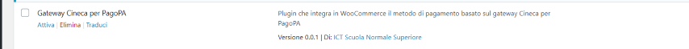
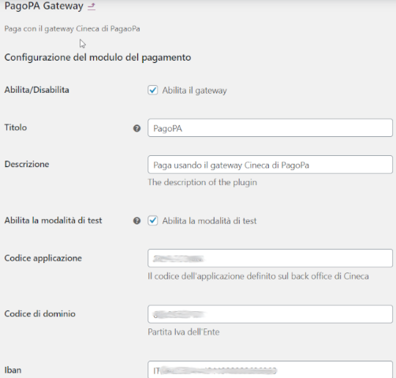
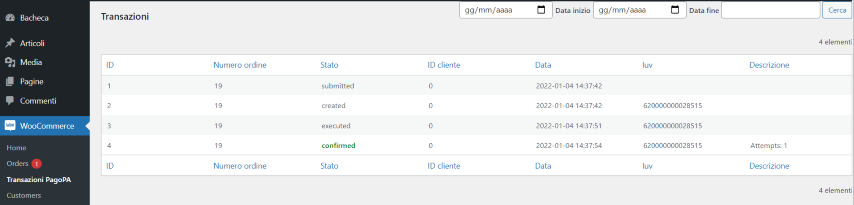

#  PagoPA Gateway
**PagoPa Gateway** is a **WooCommerce** plugin that allows integrating a payment method based on *Cineca*'s payment portal called ***PagoAtenei*** into an e-commerce website.

The plugin can be used on websites built with *WordPress* and *WooCommerce* and requires that the Institution has activated the *PagoAtenei* service by *Cineca*.

**PagoPa Gateway** allows customers of an e-commerce website to pay with **PagoPA** either ***online***, using a **credit card**, or ***offline***, by printing the payment notice and paying it at an authorized payment point.

The project was born from the need to allow customers of the "**Edizioni**" website ([edizioni.sns.it](https://edizioni.sns.it)) to pay for their orders with **PagoPA**.

## Project status
The plugin is in production on the School's e-commerce website.

## Features
- Order payment with **PagoPA**.
- Panel to configure the connection to the **Cineca** gateway and other plugin operating parameters.
- Separate configurations for the test environment and the production environment.
- Payment workflow management.
- Schedulable procedure to manage and update orders paid offline.
- Management of asynchronous payment notifications from *PagoAtenei* (*paNotificaTransazione* message).
- Management of synchronous payment confirmation.
- Internationalization of labels and messages (Italian and English).
- Transaction monitoring screen in the WordPress backoffice.
- Docker to quickly test the plugin.

## First system activation
1. Agree with *Cineca* on the activation of the *PagoAtenei* service and the test and production environments. The data provided by *Cineca* are:
   - A username to use the Soap API.
   - A password to use the Soap API.
   - The service WSDL.
   - An SSL certificate with its password.
2. Activate on the payment portal (both in the test and production environment) a Reason and a Model to associate with the e-commerce payments. The Model code is one of the plugin configuration parameters.
3. Make sure that the software requirements are met by your system (see the "***Software requirements***" section of this document).
4. Download, install and configure the plugin as described in the "***Installation and configuration***" section of this document.

## Software requirements
1. The WordPress CMS (version >= 5.6.6).
2. The WooCommerce plugin (version >= 8.3) for WordPress.
3. An Apache web server (or equivalent) with the *mod_ssl* and *soap* extensions installed and enabled.
4. Read the "***Custom fields***" section.

## Custom fields
The plugin uses the following fields to fill in the request sent to *PagoAtenei* for payment creation:
 - **_billing_ita_cf**: The Italian Tax Code (Codice Fiscale) for individuals.
 - **_billing_vat**: The VAT number for companies.

Edizioni uses another custom plugin that adds these meta tags to the order, but unfortunately that plugin cannot be published for reuse.
If these fields are not specified the plugin still works, but a customer will be treated as an individual with **Tax Code = First Name + Last Name**.

## Installation and configuration
1. [Download](https://github.com/ScuolaNormaleSuperiore/wp-pagopa-gateway-cineca/archive/refs/heads/main.zip) the latest stable version of the plugin.
2. Extract the archive contents into the **wp-content/plugins** folder.
3. Activate the plugin from the WordPress administration interface.
4. Configure the plugin from the WordPress administration interface (*W->WooCommerce->Settings->Payments->PagoPA Gateway->Manage*):
   - **Enable/Disable**: Flag to enable or disable the plugin.
   - **Title**: The name of the payment method shown on the order checkout page.
   - **English description**: An English description of the payment method. It is visible in the English version of the order checkout page.
   - **Description**: An Italian description of the payment method. It is visible in the Italian version of the order checkout page.
   - **Enable test mode**: Flag to enable or disable test mode and the connection to *Cineca*'s test environment.
   - **Payment confirmation methods**:
   - - **Polling on PagoAtenei**: The order is considered valid if the plugin callback is invoked by *PagoAtenei* with a valid token and if a pending order exists with that order number and IUV. An additional check on the payment status can be activated by enabling the "***Payment confirmation***" flag.
   - - **Asynchronous notification from PagoAtenei**: The order is considered paid only if *PagoAtenei* sends a **paNotificaTransazione** message with **esito=PAGAMENTO_ESEGUITO**.
   - **Payment confirmation**: If set, the callback invoked by *PagoAtenei* after a payment waits for the payment notification to be propagated from the PSP to *PagoAtenei*. This check is performed by polling *PagoAtenei* (gpChiediStatoVersamento); if not set, the plugin considers the order paid without further checks.
   - **Application code**: The application code provided by *Cineca*.
   - **Domain code**: The Institution's VAT number.
   - **Iban**: The Institution's IBAN.
   - **Accounting type**: Accounting type as defined by the *PagoPA* taxonomy, available [here](https://github.com/pagopa/pagopa-api/blob/develop/taxonomy/tassonomia.json).
   - **Payment validity**: Number of hours for which the payment is valid. It is possible to make the payment at an authorized payment point using the IUV.
   - **Certificate file name**: The name of the ***pem*** certificate provided by Cineca. If the certificate provided is in *pk12* format it should be converted to *pem* format.
   - **Certificate password**: The certificate password provided by *Cineca*.
   - **Order prefix**: A prefix added to the WooCommerce order number before it is sent to the payment gateway. It is useful to distinguish orders from multiple instances of the same site, especially during testing. Can be empty.
   - **Encryption key**: The key used to encrypt the token sent to the gateway.
   - **Plugin API token**: The token used to authenticate the invocation of scheduled actions and the plugin REST API. If empty, the feature is disabled.

  **Production credentials**
   - **Cineca front end base address**: The *PagoAtenei* front-end URL. Provided by *Cineca*.
   - **PagoAtenei URL**: The base address of the *PagoAtenei* SOAP web services. Provided by *Cineca*.
   - **PagoAtenei API username**: The username to use to invoke the *PagoAtenei* web services. Provided by *Cineca*.
   - **PagoAtenei password**: The password to use to invoke the *PagoAtenei* web services. Provided by *Cineca*.
   - **Plugin API username**: The username of the account that *PagoAtenei* must use to invoke the *paNotificaTransazione* entry-point. Must be communicated to *Cineca*.
   - **Plugin API password**: The password of the account that *PagoAtenei* must use to invoke the *paNotificaTransazione* entry-point. Must be communicated to *Cineca*.
   - **Payment model ID**: The ID of the payment model defined in the *PagoAtenei* backoffice for the e-commerce orders.

  **Test credentials**
   - **Cineca front end base address**: The *PagoAtenei* front-end URL. Provided by *Cineca*.
   - **PagoAtenei URL**: The base address of the *PagoAtenei* SOAP web services. Provided by *Cineca*.
   - **PagoAtenei API username**: The username to use to invoke the *PagoAtenei* web services. Provided by *Cineca*.
   - **PagoAtenei password**: The password to use to invoke the *PagoAtenei* web services. Provided by *Cineca*.
   - **Plugin API username**: The username of the account that *PagoAtenei* must use to invoke the *paNotificaTransazione* entry-point. Must be communicated to *Cineca*.
   - **Plugin API password**: The password of the account that *PagoAtenei* must use to invoke the *paNotificaTransazione* entry-point. Must be communicated to *Cineca*.
   - **Payment model ID**: The ID of the payment model defined in the *PagoAtenei* backoffice for the e-commerce orders.

## Payment confirmation: possible configurations
- **Payment confirmation method** = ***Asynchronous notification from *PagoAtenei*** and **Payment confirmation** = ***false***: The order is considered paid only when PagoAtenei invokes the ***paNotificaTransazione*** entry-point. The site must be hosted on a public server and *Cineca* must be asked to activate and configure the ***paNotificaTransazione*** message. This configuration cannot be tested in a local development environment.
- **Payment confirmation method** = ***Polling on PagoAtenei*** and **Payment confirmation** = ***false***: The order is considered paid only if the callback is correctly invoked by *PagoAtenei* and the order is in the correct state. No additional checks are performed.
- **Payment confirmation method** = ***Polling on PagoAtenei*** and **Payment confirmation** = ***true***: The callback, after checking the token and the order status, polls *PagoAtenei* until *PagoAtenei* receives the payment notification from the **PSP**.

The first of those listed is the recommended and most secure configuration.

## Flow diagrams
The following images graphically explain the flow and operation of the system:
- [State diagram](https://github.com/ScuolaNormaleSuperiore/wp-pagopa-gateway-cineca/blob/main/docs/schema/SchemaDegliStati.png)
- [Payment diagram](https://github.com/ScuolaNormaleSuperiore/wp-pagopa-gateway-cineca/blob/main/docs/schema/SchemaDeiPagamenti.png)

## How to test the PagoAtenei SOAP API
After requesting and obtaining the connection parameters from *Cineca*, you can use the *SoapUI* program to test the web services. In the *setup\TestSoap* folder there is a project that can be imported and used in SoapUI. Alternatively, you can create a new project using the following [WSDL](https://gateway.pp.pagoatenei.cineca.it/portalepagamenti.server.gateway/api/private/soap/GPAppPort?wsdl) file.
In the *setup\TestApiSoapWithPhp* folder there are two PHP scripts (*testCaricaVersamento.php* and *testChiediStatoVersamento.php*) to verify the connection with the *PagoAtenei* APIs.

## Entry points and callbacks
The plugin exposes the following entry-points:

1. HOOK_PAYMENT_COMPLETE --> pagopa_payment_complete: this is the callback invoked by *PagoAtenei* when an order is paid or cancelled.

2. HOOK_SCHEDULED_ACTIONS --> pagopa_execute_actions: this is the entry-point that can be invoked by a cronjob to manage orders paid offline.

3. HOOK_TRANSACTION_NOTIFICATION --> pagopa_notifica_transazione: this is the entry-point invoked by *PagoAtenei* to notify the payment of an order.

## Gallery

**Image 1:** Backoffice: plugin activation.

**Image 2:** Backoffice: plugin configuration.

**Image 3:** Backoffice: transaction monitoring.

## Documentation
- The plugin documentation and flow diagrams are located in the ***docs*** folder of this plugin.
- The project and examples for testing the SOAP API with *SoapUI* are located in the ***setup/TestSoap*** folder.
- For documentation and specifications on the SOAP API, visit the *Cineca* website:
	- [Integration Modes](https://wiki.u-gov.it/confluence/pages/releaseview.action?pageId=329846832)
	- [WS pago-ATENEI Applications](https://wiki.u-gov.it/confluence/display/public/UGOVINT/WS+pago-ATENEI+Applicazioni)

## Demo
### Docker
You can test the plugin using a *Docker* container that contains all the required software components (WordPress + WooCommerce + wp-pagopa-gateway-cineca).
The Dockerfile to use is: [Dockerfile](https://github.com/ScuolaNormaleSuperiore/wp-pagopa-gateway-cineca/blob/main/setup/Docker/Dockerfile).

The commands to build and run the container are:
- docker build -t myshop-img -f Dockerfile .
- docker run -p 80:80 -p 3306:3306 --name=myshop -d myshop-img

To connect to the container shell, run the command:
- docker exec -it myshop /bin/bash

The URL of the newly created e-commerce is: http://localhost/myshop/ .

To test the plugin you need to enable and configure it with the data provided by *Cineca*.

To log in as site administrator the URL is http://localhost/wp-admin/ and the account is: manager / password

The *Adminer* tool is installed on the container to manage the database tables.
The *Adminer* URL is: http://localhost/adminer.php
The configuration parameters are:
- System: Mysql
- Server: 127.0.0.1
- User: admin
- Password: admin
- Database: myshop

## Checkout page blocks support
Starting from ***WooCommerce 8.3***, for new installations the Cart and Checkout blocks are present by default. For this reason a block (defined in *class-block.php*) has been added for the checkout page.
Read [this page](https://woo.com/document/cart-checkout-blocks-status) for more information.

## Reuse catalogue
The project is published on the Developers Italia reuse catalogue. The project home page is [here](https://developers.italia.it/it/software/sns_pi-scuolanormalesuperiore-wp-pagopa-gateway-cineca).

## Repository
[This](https://github.com/ScuolaNormaleSuperiore/wp-pagopa-gateway-cineca) is the repository containing the project source code.

## License
The project is published under the GPL-3.0-only license as described in the [LICENSE](https://github.com/ScuolaNormaleSuperiore/wp-pagopa-gateway-cineca/blob/main/LICENSE) file.

## Supported languages
The plugin is available in Italian and English.
[This](https://github.com/ScuolaNormaleSuperiore/wp-pagopa-gateway-cineca/blob/main/README.md) is the Italian guide.

## How to contribute
The main purpose of this repository is to evolve the plugin. We would like to make the process of contributing to the project as simple and transparent as possible, and we will be grateful to the community of those who wish to contribute to bug fixing, code improvement and the addition of new features.

## Copyright
1. Copyright holder: Scuola Normale Superiore
2. Project managers: Michele Fiaschi, Claudio Battaglino, Alida Isolani, Marcella Monreale
